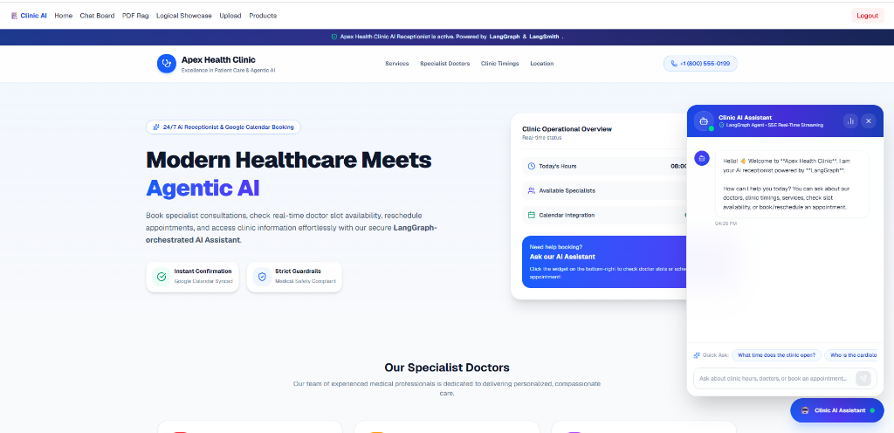
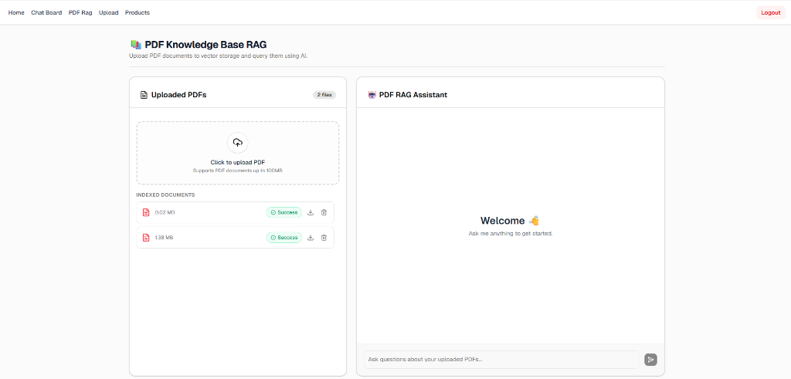
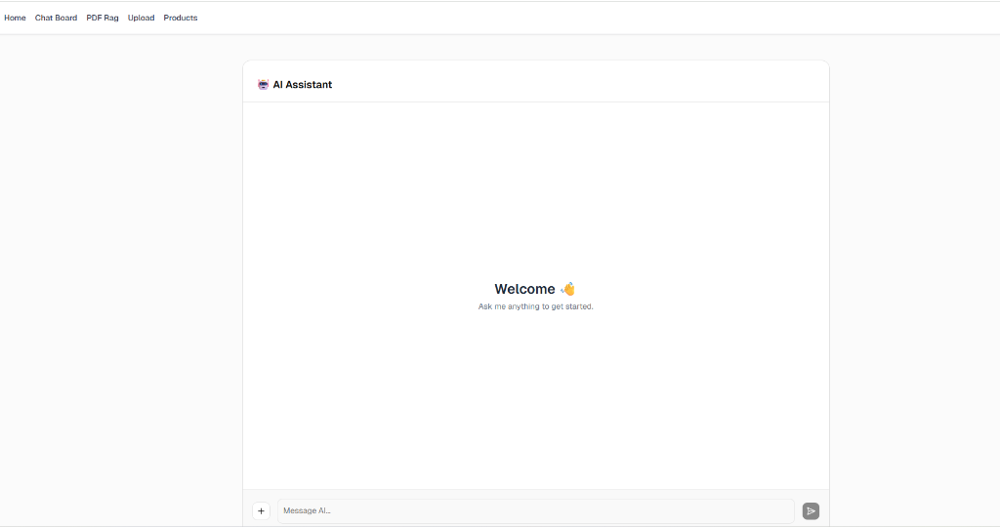

# 🚀 AI Demo: Agentic AI Healthcare Platform, PDF Knowledge Base RAG & Chat

A modern, enterprise-ready full-stack AI platform featuring **Apex Health Clinic LangGraph Agentic AI Receptionist & Appointment Scheduling**, **PDF Knowledge Base Retrieval-Augmented Generation (RAG)**, **user-isolated vector search**, **asynchronous background processing**, and **automated DevSecOps CI/CD pipeline**.

Built with a high-performance **Bun Workspace Monorepo**, Fastify backend, React PWA, LangGraph, LangSmith, Qdrant Vector Database, MongoDB, BullMQ, and Google Gemini AI.

---

## 📸 Screenshots & User Interface

### 🏥 Apex Health Clinic AI Receptionist & Appointment Booking


### 📚 PDF Knowledge Base RAG Interface


### 🤖 AI Chat Board Interface


---

## 🌟 Key Features

### 🏥 1. Apex Health Clinic - Agentic AI Receptionist & Scheduling
- **LangGraph Multi-Node State Machine**: Sophisticated state graph with deterministic routing:
  - `Input Validation Node`: Sanitizes user input and enforces conversation limits.
  - `Intent Classification Node`: Accurately routes user queries to knowledge lookup, slot checking, booking, or cancellation.
  - `Knowledge Base Node`: Answers clinic questions (hours, location, specialist doctors, services).
  - `Appointment & Tools Node`: Interacts with Google Calendar API and MongoDB for real-time doctor availability checking, booking, and rescheduling.
  - `Medical Guardrails Node`: Strictly blocks medical advice, diagnosis, and prescriptions, while gracefully routing emergencies to human providers.
- **Real-Time SSE Streaming Chat Widget**: Floating, interactive patient assistant featuring instant Server-Sent Events (SSE) token streaming, suggested quick-ask prompts, and interactive confirmation badges.
- **LangSmith Tracing & Evaluation**: Integrated run tracing, latency/token observability, and automated LLM-as-a-judge evaluations (`/api/clinic/eval`).

### 📚 2. PDF Knowledge Base RAG
- **User-Isolated Vector Search**: Documents and vector embeddings in Qdrant are tagged with `userId`. Vector queries are strictly filtered so users only retrieve context from their own uploaded PDFs.
- **Context-Augmented AI Responses**: Uses Google Gemini (`gemini-3.6-flash`) and `@langchain/google-genai` embeddings (`models/gemini-embedding-001`) to provide accurate answers backed by uploaded documents.
- **Clickable Reference PDF Downloads**: AI responses include source PDF references (`{ name, url }`) rendered as clickable badges with download buttons.

### ⚡ 3. Asynchronous Indexing & Status Pipeline
- **BullMQ Background Queue**: Heavy PDF parsing, chunking, and embedding generation are offloaded to background BullMQ worker threads.
- **Real-Time Status Pipeline**:
  - `Uploading...`: File transfer over HTTP.
  - `Initializing...`: Saved to MongoDB, enqueued for background vector indexing.
  - `Success`: Vectors embedded and stored in Qdrant.
  - `Failed Upload`: Failed transfer or indexing, with inline **Retry Upload** action.
- **Automatic Status Polling**: Frontend automatically polls status every 3 seconds while documents are pending, then pauses once indexed.

### 🔐 4. Authentication & API Security
- **JWT Authorization**: Route decorators for JWT verification (`@fastify/jwt`).
- **Interactive Swagger Docs**: OpenAPI specification generated automatically at `/api/docs`.

### 🛒 5. Products & General Chat
- **Product Management**: Paginated product catalog listing and deletion handlers.
- **General AI Assistant**: Standalone AI chat board for non-document queries.

### 🛡️ 6. Automated CI/CD & DevSecOps Pipeline
- **Jenkins Declarative Pipeline**: Automated build, test, security scans, and container deployment.
- **SonarQube & Quality Gate**: Static Application Security Testing (SAST) and quality gate threshold enforcement.
- **Trivy Container Scanning**: Dockerized vulnerability scanner filtering HIGH/CRITICAL CVEs on built images.
- **OWASP Dependency Check**: Software Composition Analysis (SCA) for third-party dependency vulnerabilities.
- **Docker Hub & Compose Automation**: Automated image version tagging, multi-container orchestration, and email notifications.
- 📖 **Full Pipeline Documentation**: [docs/JENKINS_CI_CD.md](docs/JENKINS_CI_CD.md)

---

## 🛠️ Technology Stack

| Layer | Technologies Used |
| :--- | :--- |
| **Agentic AI & Orchestration** | LangGraph, LangChain, LangSmith, Google Gemini (`gemini-3.6-flash`) |
| **Frontend App (`apps/pwa`)** | React 18, Vite, Tailwind CSS, `@tanstack/react-query`, Lucide Icons |
| **Backend API (`apps/server`)** | Fastify, TypeScript, `@fastify/jwt`, `@fastify/multipart`, Swagger UI |
| **Vector Engine & Embeddings** | Qdrant Vector DB, Gemini Embeddings (`models/gemini-embedding-001`) |
| **Data & Messaging** | MongoDB, BullMQ, Redis / Valkey, Google Calendar API |
| **CI/CD & DevSecOps** | Jenkins, SonarQube, Trivy, OWASP Dependency Check, Docker Hub |
| **Runtime & Tooling** | Bun Workspaces, Docker Compose, Prettier, Husky |

---

## 📁 Repository Structure

```
ai-demo/
├── docs/
│   ├── JENKINS_CI_CD.md       # Complete Jenkins CI/CD & DevSecOps Pipeline Guide
│   ├── Vapi+Make Voice Appointment/ # Voice Agent Prompts & Automation Workflows
│   └── images/                # Application preview screenshots
│       ├── clinic_preview.png # Apex Health Clinic AI Receptionist screenshot
│       ├── pdf_rag_preview.png# PDF RAG interface screenshot
│       └── chatboard_preview.png# AI Chat board screenshot
│
├── apps/
│   ├── pwa/                   # React PWA Frontend
│   │   ├── src/
│   │   │   ├── components/    # Reusable UI cards & layout (ChatWidget, PdfManager)
│   │   │   ├── hooks/         # Custom React Query hooks (useUserPdfs, useUploadPdf)
│   │   │   ├── pages/         # Page routes (ClinicPage, PdfRag, ChatBoard, Products)
│   │   │   └── type/          # Centralized frontend types (pdf.ts, chat.ts, product.ts)
│   │   └── package.json
│   │
│   └── server/                # Fastify Backend & Worker
│       ├── agent/             # LangGraph Multi-Node State Graph & Tools
│       │   ├── nodes/         # Intent, Guardrail, Knowledge, Appointment, Tools nodes
│       │   ├── tools/         # Availability, Booking, Rescheduling tools
│       │   └── graph.ts       # Compiled LangGraph Workflow
│       ├── appointments/      # Google Calendar & MongoDB Appointment Services
│       ├── controllers/       # HTTP Controllers (ChatController, UserControllers)
│       ├── langsmith/         # LangSmith Tracing & Evaluators
│       ├── lib/               # Reusable singletons (genai, vectorStore, mongodb)
│       ├── repositories/      # MongoDB Repositories (pdf, user, product)
│       ├── routers/           # Fastify Route definitions (clinic, chat, user, product)
│       ├── schemas/           # OpenAPI / JSON Validation Schemas
│       ├── scripts/           # DB Seeders (userSeed, productSeed, imageSeed, pdfSeed)
│       ├── worker.js          # BullMQ Background Worker for Qdrant indexing
│       ├── index.ts           # Fastify server entry point
│       └── package.json
│
├── docker-compose.yml         # Container orchestration (Server, PWA, Mongo, Redis, Qdrant)
└── package.json               # Root monorepo workspace scripts
```

---

## ⚙️ Environment Configuration

### 1. Server Environment (`apps/server/.env`)
Create `apps/server/.env` with the following variables:

```env
PORT=3001
MONGODB_URI=mongodb://localhost:27017/
DB_NAME=ai_demo
JWT_ACCESS_SECRET=your_jwt_secret_key_here
GEMINI_API_KEY=your_google_gemini_api_key
REDIS_HOST=localhost
REDIS_PORT=6379
QDRANT_URL=http://localhost:6333
UPLOAD_LIMIT=100
WORKER_BATCH_SIZE=10
WORKER_MAX_RETRIES=2
WORKER_BASE_DELAY_MS=5000
LANGSMITH_API_KEY=your_langsmith_api_key_here
LANGSMITH_PROJECT=ai-demo-clinic
```

### 2. Frontend Environment (`apps/pwa/.env`)
Create `apps/pwa/.env` with the following variables:

```env
VITE_API_URL=http://localhost:3001
```

---

## 🚀 Quick Start Guide

### Prerequisites
- [Bun](https://bun.sh) (v1.1+) or Node.js (v20+)
- [Docker](https://www.docker.com/) & Docker Compose

---

### Method 1: Local Development (Recommended)

1. **Install Monorepo Dependencies**:
   ```bash
   bun install
   ```

2. **Start Infrastructure Services (MongoDB, Redis, Qdrant)**:
   ```bash
   docker compose up -d mongo valkey qdrant
   ```

3. **Seed Database Collections & Default Users**:
   ```bash
   cd apps/server
   bun run seed
   ```

4. **Start Development Server & Background Worker**:
   Open 2 terminal tabs:

   - **Terminal 1 (Backend & Frontend)**:
     ```bash
     bun run dev
     ```
   - **Terminal 2 (BullMQ Indexing Worker)**:
     ```bash
     bun run worker
     ```

5. **Access Applications**:
   - **PWA Application**: [http://localhost:5173](http://localhost:5173)
   - **Clinic AI Assistant Page**: [http://localhost:5173/clinic](http://localhost:5173/clinic)
   - **Backend API**: [http://localhost:3001](http://localhost:3001)
   - **Interactive API Documentation (Swagger UI)**: [http://localhost:3001/api/docs](http://localhost:3001/api/docs)

---

### Method 2: Full Docker Stack

Run the complete platform inside Docker containers:

```bash
docker compose up --build
```

---

## 📡 API Endpoints Summary

| Method | Endpoint | Protection | Description |
| :--- | :--- | :--- | :--- |
| `POST` | `/api/clinic/chat/stream` | Public | Real-time SSE streaming LangGraph AI Clinic Receptionist |
| `GET` | `/api/clinic/slots` | Public | Check doctor availability & open consultation slots |
| `POST` | `/api/clinic/eval` | Public | Run LangSmith LLM-as-a-judge agent evaluation |
| `GET` | `/api/clinic/metrics` | Public | Health and observability metrics for clinic agent |
| `POST` | `/api/user/login` | Public | Authenticate user & get JWT token |
| `GET` | `/api/user-pdfs` | JWT Auth | Get uploaded PDFs owned by current user |
| `POST` | `/api/upload-pdf-rag` | JWT Auth | Upload PDF for background vector indexing |
| `DELETE` | `/api/user-pdfs/:id` | JWT Auth | Delete PDF document & clean up Qdrant vectors |
| `POST` | `/api/pdfchat` | JWT Auth | Perform user-isolated PDF RAG query |
| `POST` | `/api/chat` | JWT Auth | Perform general AI chat query |
| `GET` | `/uploads/*` | Public | Download uploaded PDF reference documents |
| `GET` | `/api/docs` | Public | Interactive Swagger UI API Documentation |

---

## 🧪 Seeding Default User Accounts

Running `bun run seed` populates MongoDB with initial test accounts:

| Email | Password | Status |
| :--- | :--- | :--- |
| `bhavin@gmail.com` | `admin123` | Active |
| `renish@gmail.com` | `admin123` | Active |
| `muffin@gmail.com` | `admin123` | Inactive |
