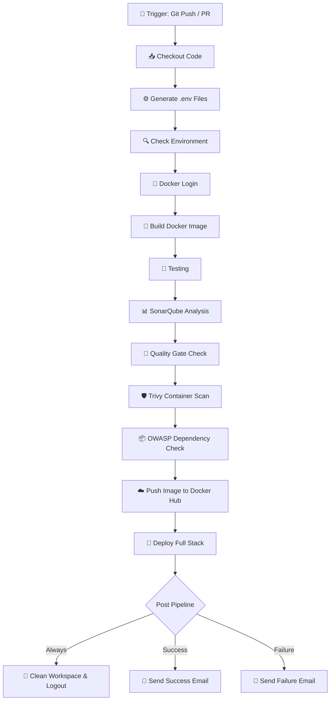

# 🚢 Jenkins CI/CD & DevSecOps Pipeline Documentation

This document outlines the architecture, stages, security scans, credentials configuration, and execution flow for the automated CI/CD pipeline defined in [`Jenkinsfile`](../Jenkinsfile).

---

## 📌 Pipeline Overview

The pipeline automates testing, code quality inspection, container vulnerability scanning, Docker image publishing, automated deployment, and status notifications for the **AI Demo Monorepo**.



---

## 🏗️ Pipeline Stages in Detail

### 1. 📥 `Checkout Code`
- Clones the latest commit from the repository (`main` branch) to the local Windows workspace.

### 2. ⚙️ `Generate .env File`
- Injects sensitive runtime configuration from Jenkins credential store using `withCredentials`:
  - **`ServerEnv`** (Secret File) ➔ `apps/server/.env`
  - **`PwaEnv`** (Secret File) ➔ `apps/pwa/.env`

### 3. 🔍 `Check Environment`
- Verifies system prerequisites on the `LocalWindows` Jenkins agent:
  - `docker --version`
  - `docker info`
  - `git --version`

### 4. 🔑 `Docker Login`
- Authenticates securely with Docker Hub using `DockerHub` username/password credentials via `--password-stdin` to prevent credentials from appearing in logs.

### 5. 🐳 `Build Docker Image`
- Builds the multi-stage Docker container from the root [`Dockerfile`](../Dockerfile):
  - Tag 1: `${IMAGE_NAME}:${BUILD_NUMBER}` (e.g., `bhavin42/ai-demo:42`)
  - Tag 2: `${IMAGE_NAME}:latest`

### 6. 🧪 `Testing`
- Executes automated test suites (e.g., unit/integration tests with Bun or Node).

### 7. 📊 `SonarQube Analysis` (Static Application Security Testing - SAST)
- Leverages the configured `SonarQubeScanner` tool (`SONAR_HOME`).
- Connects to the SonarQube server via `withSonarQubeEnv('SonarQubeServer')`.
- Parameters configured:
  - `sonar.projectKey=ai-demo`
  - `sonar.projectName=ai-demo`
  - `sonar.sources=.`
  - `sonar.exclusions=**/node_modules/**,**/dist/**,**/.git/**,**/.husky/**`

### 8. 🚦 `Quality Gate`
- Pauses pipeline execution and queries SonarQube Quality Gate status (`waitForQualityGate`).
- Fails and aborts the pipeline if defined code quality metrics (bugs, vulnerabilities, code smells, test coverage) fail within 2 minutes.

### 9. 🛡️ `Trivy Security Scan` (Container Vulnerability Scanning)
- Runs Aqua Security's **Trivy** in a Docker container to scan the newly built Docker image:
  ```bat
  docker run --rm -v //var/run/docker.sock:/var/run/docker.sock aquasec/trivy:latest image --no-progress --exit-code 1 --severity HIGH,CRITICAL ${IMAGE_NAME}:${IMAGE_TAG}
  ```
- **Flags**:
  - `-v //var/run/docker.sock:/var/run/docker.sock`: Mounts the host Docker socket for direct image inspection.
  - `--severity HIGH,CRITICAL`: Filters findings to critical and high severity issues.
  - `--exit-code 1`: Automatically fails the build if unaddressed high/critical vulnerabilities are detected.

### 10. 📦 `OWASP Dependency Check` (Software Composition Analysis - SCA)
- Scans third-party project dependencies for known CVEs and vulnerabilities in libraries and manifests.

### 11. ☁️ `Push Image to Docker Hub`
- Pushes both the versioned build tag and `latest` tag to Docker Hub:
  - `${IMAGE_NAME}:${BUILD_NUMBER}`
  - `${IMAGE_NAME}:latest`

### 12. 🚀 `Deploy`
- Orchestrates multi-container local stack deployment via Docker Compose:
  ```bat
  docker compose down --remove-orphans
  docker compose up -d
  docker compose ps
  ```

---

## 📬 Post-Build Actions & Notifications

| Condition | Action | Description |
| :--- | :--- | :--- |
| **`always`** | `cleanWs()` & `docker logout` | Cleans up the agent workspace directory and clears Docker registry credentials. |
| **`success`** | `emailext` | Sends an email notification with attached build logs confirming successful build, push, and deployment. |
| **`failure`** | `emailext` | Sends an urgent failure alert with complete console logs for rapid debugging. |

---

## ⚙️ Jenkins Configuration & Credentials Setup

To run this pipeline successfully, the following configurations must exist on your Jenkins instance:

### 1. Agent Label
- **`LocalWindows`**: A Jenkins agent (controller or worker) running on Windows with Docker Desktop and Git installed.

### 2. Global Tools (`Manage Jenkins > Tools`)
- **SonarQube Scanner**:
  - Name: `SonarQubeScanner`
  - Install automatically or provide local installation path.

### 3. System Configuration (`Manage Jenkins > System`)
- **SonarQube Servers**:
  - Name: `SonarQubeServer`
  - Server URL: e.g., `http://localhost:9000` or your remote SonarQube host.
  - Server authentication token configured.
- **Extended E-mail Notification (`emailext`)**:
  - SMTP server settings configured for sending alerts from `bhavindami@gmail.com`.

### 4. Credentials Store (`Manage Jenkins > Credentials`)

| Credential ID | Type | Description |
| :--- | :--- | :--- |
| `DockerHub` | Username with password | Docker Hub registry credentials (`DOCKER_USER`, `DOCKER_PASS`) |
| `ServerEnv` | Secret file | Production `.env` configuration file for `apps/server` |
| `PwaEnv` | Secret file | Production `.env` configuration file for `apps/pwa` |

---

## 🛠️ Quick Troubleshooting Guide

- **Docker Socket Access on Windows**: If Trivy fails to communicate with the Docker daemon, verify Docker Desktop is running and that `//var/run/docker.sock:/var/run/docker.sock` is used on Windows agents.
- **SonarQube Scanner Path**: If `sonar-scanner` is not found, verify that the tool name matches `SonarQubeScanner` in Jenkins Global Tool Configuration.
- **Quality Gate Timeout**: Ensure the SonarQube webhook is configured to notify Jenkins when analysis finishes (`<jenkins-url>/sonarqube-webhook/`).
